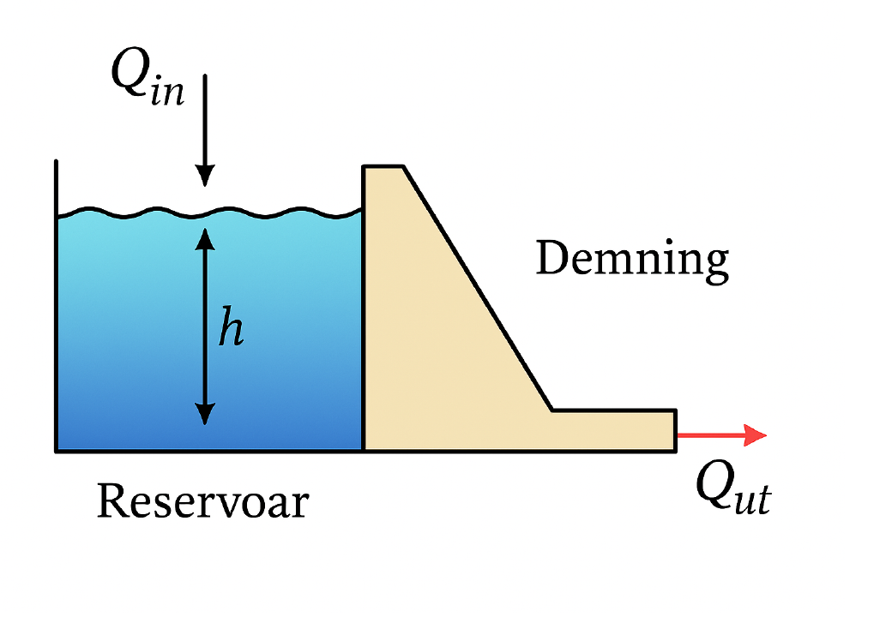
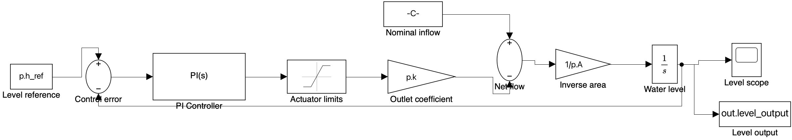
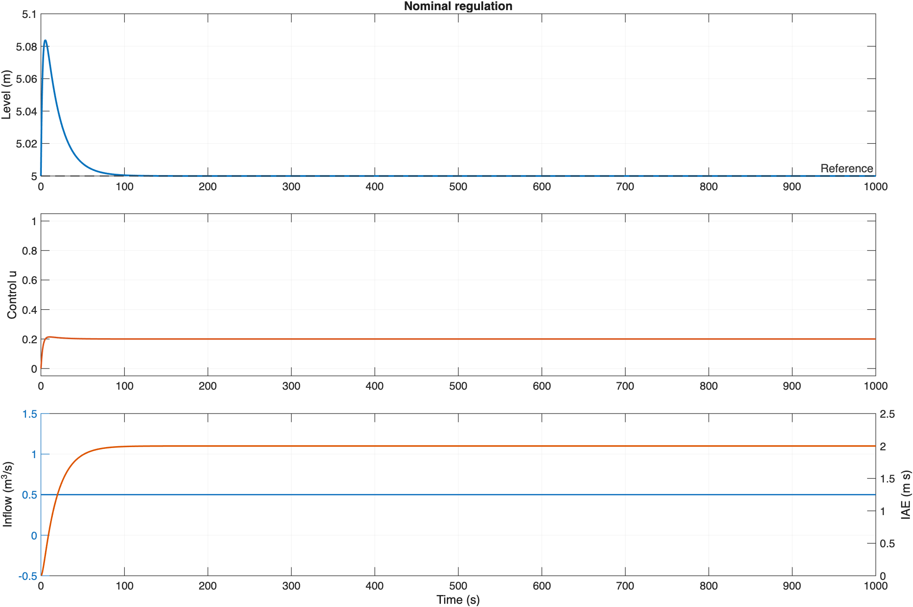
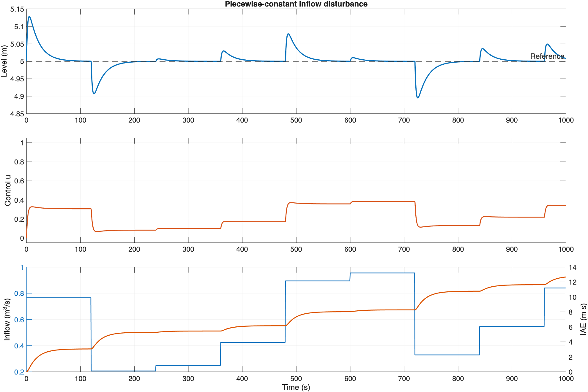
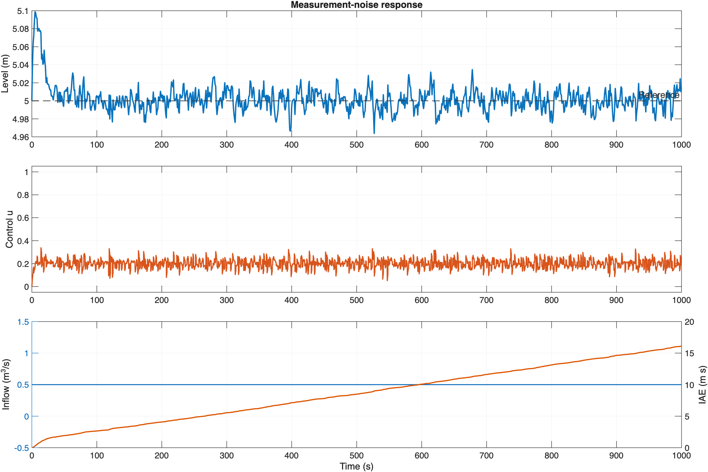

# PI Control of Dam Water Level

Reconstruction and verification of a water-level control project completed for **TTK4105 - Control Engineering** at NTNU in spring 2025. The project models a reservoir from a mass balance, applies a PI controller to the outlet flow, and evaluates reference regulation, inflow disturbances, measurement noise and integral absolute error (IAE).



*Simplified reservoir system recovered from the submitted project report.*

## Project status

| Item | Status |
| --- | --- |
| Mathematical model | Reconstructed from the submitted report |
| MATLAB simulation | Recreated and executable |
| Simulink model | Report-faithful top level with an inspectable PI subsystem |
| Baseline, disturbance and noise cases | Recreated |
| Original report screenshots | Used as traceability evidence, not as quantitative validation |
| Physical dam validation | Outside project scope |

> This repository is a transparent portfolio reconstruction. The original MATLAB and Simulink files were not preserved. Equations, parameters and scenario definitions were recovered from the submitted group report; the code and generated model in this repository were created after the course.

## Model

The simplified reservoir assumes constant horizontal area and linear outlet flow:

```text
A dh/dt = Qin - k u
e = href - hmeasured
u = Kp e + Ki integral(e dt)
```

The negative controller gains are intentional. Increasing `u` increases the outlet flow and therefore lowers the water level, so the plant has negative input-to-level gain.

### Simulink implementation



The report-faithful top level contains the reference, error calculation, PI controller, actuator limits, outlet-flow model, reservoir mass balance and measured-level feedback. The proportional and integral branches can be inspected by opening the **PI Controller** subsystem.

### Reconstructed parameters

| Parameter | Value | Meaning |
| --- | ---: | --- |
| `A` | 10 m² | Reservoir surface area |
| `k` | 2.5 | Outlet-flow coefficient |
| `Kp` | -2 | Proportional gain |
| `Ki` | -0.1 | Integral gain |
| `href` | 5 m | Level reference |
| `Qin` | 0.5 m³/s | Nominal inflow |
| `h(0)` | 5 m | Initial level |

## Repository structure

```text
documentation/  Model assumptions, provenance and verification notes
models/         Generated Simulink model
results/        Recreated plots and summary metrics
scripts/        MATLAB simulation, model builder and verification
```

## Run the project

Open MATLAB in the repository root and run:

```matlab
addpath("scripts")
build_simulink_model
run_all_scenarios
verify_project
```

The scripts generate `models/pi_dam_water_level.slx`, scenario plots and `results/metrics.csv`. The model's top level mirrors the architecture shown in the submitted report. Opening the **PI Controller** subsystem reveals the proportional and integral branches used in the reconstruction.

## Scenarios

1. **Nominal regulation:** constant inflow of 0.5 m³/s.
2. **Inflow disturbance:** seeded, piecewise-constant inflow between 0 and 1 m³/s, updated every 120 seconds as described in the report.
3. **Measurement noise:** seeded band-limited measurement noise applied to the feedback signal.

## Recreated results

### Nominal regulation



### Inflow disturbance



### Measurement noise



## Engineering interpretation

This is a conceptual control-engineering model rather than a deployable dam controller. Constant area, linear discharge, instantaneous actuation and simplified noise exclude important hydraulic effects. The reconstruction therefore demonstrates modelling and control principles, not real-world dam safety or performance.

## Authorship and licence

The original academic report was collaborative work by four students. This reconstruction documents Mohamed Elwalid Fadul's portfolio review of that work. No open-source licence is granted; the repository is provided for portfolio and review purposes.
